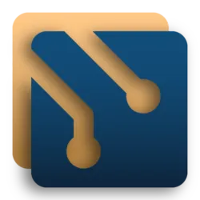

  <h1> BootCamp </h1>

BootCamp is a fork of melonchat at https://github.com/melonchat/melonchat, with the bootstrap of IHP at https://github.com/digitallyinduced/ihp

BootCamp offers a similar model to Coursera, but differs by partnering experienced coders (the teachers) with beginners in correcting and offering insight into programming "homework".  

Pull requests are welcome! We have a [spec](docs/README.md). Issues correspond to spec items, but feel free to contact me (or just fork the thing) if you wish to help.

See [CONTRIBUTING](CONTRIBUTING.md) for how to get started and [ARCHITECTURE](ARCHITECTURE.md) for a high level overview of the project.
